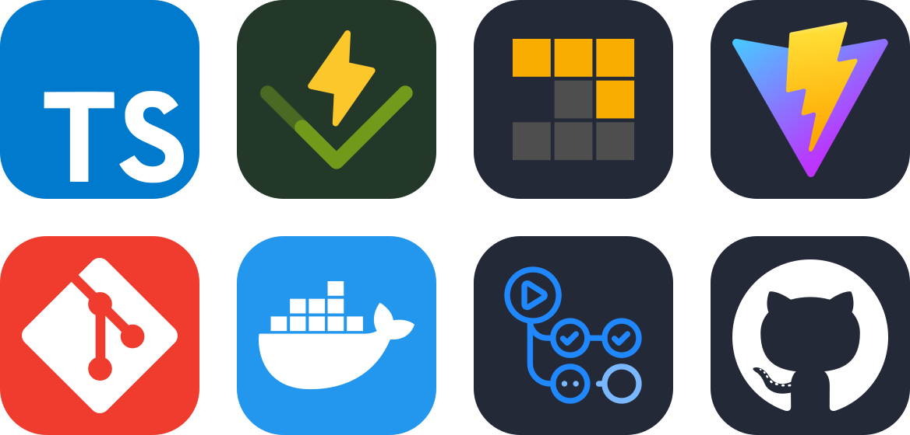

<h1 align="center"> Design Pattern Study </h1>

This is a repository with the purpose of studying design patterns in a practical way, creating code examples with typescript and testing those examples with vitest, you can run the tests in your machine using docker or a local envirioment with node. In this this project there is also a documentation with the main concepts of each pattern.

The patterns can be separated in three main categories: Creational, Structural and Behavioral. Each category has its own folder in the `src` directory, and each pattern has its own folder inside the category folder, this is also true for the [tests folder](./tests/) and the [documentation folder](./docs/).

Currently the project implements four patterns of each category, but more patterns will be added in the future.

## List of patterns implemented 📜

-   **Creational Pattern**

    -   Builder ([CODE](./src/creational/builder) | [DOCS](./docs/builder.md))
    -   Factory ([CODE](./src/creational/factory) | DOCS)
    -   Prototype ([CODE](./src/creational/prototype) | [DOCS](./docs/prototype.md))
    -   Singleton ([CODE](./src/creational/singleton) | [DOCS](./docs/singleton.md))

-   **Structural Pattern**

    -   Adapter ([CODE](./src/structural/adapter) | DOCS)
    -   Proxy ([CODE](./src/structural/proxy) | DOCS)
    -   Composite ([CODE](./src/structural/composite) | DOCS)
    -   Decorator ([CODE](./src/structural/decorator) | DOCS)

-   **Behavioral Pattern**

    -   Template Method ([CODE](./src/behavioral/template-method) | DOCS)
    -   Strategy ([CODE](./src/behavioral/strategy) | DOCS)
    -   Iterator ([CODE](./src/behavioral/iterator) | [DOCS](./docs/iterator.md))
    -   Observer ([CODE](./src/behavioral/observer) | [DOCS](./docs/observer.md))

<br />

## Running tests locally with node 🧪

```bash
> pnpm test
# OR
> pnpm test:dev # watch mode
```

## Running tests with docker 🐳

```bash
> docker build -t dp-test .
> docker run -it --rm dp-test
# OR
> pnpm test:docker
```

### Tools 🛠

<p align="center">

</p>

## Entre em contato 📞

<br>

<p align="center">
<a href="https://www.linkedin.com/in/luis-felipe-vanin-martins-5a5b38215">

</a>
<a href="mailto:luisfvanin2@gmail.com">

</a>
